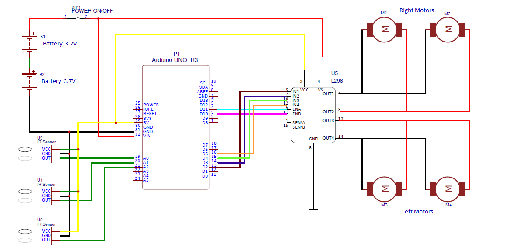
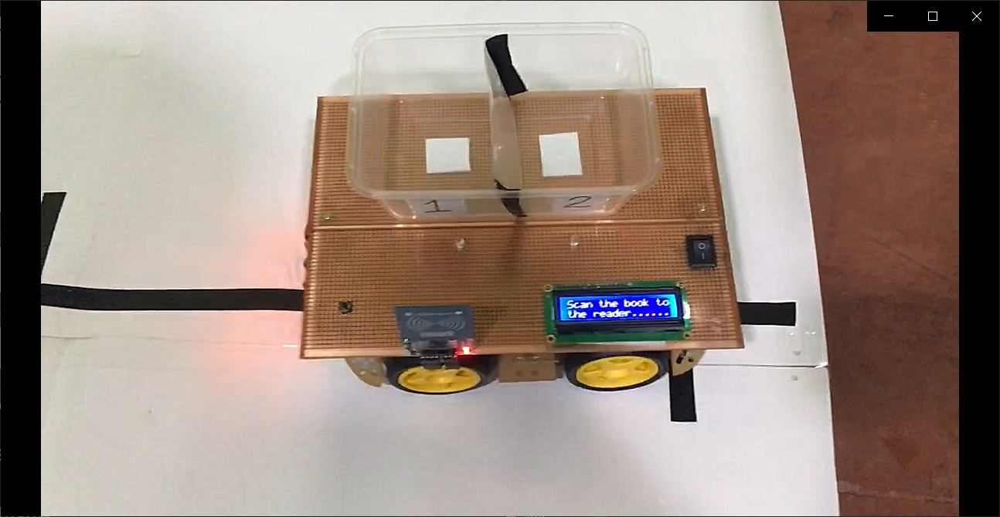

[comment]: # "This is the standard layout for the project, but you can clean this and use your own template"

# Automated Book Management System - Automated Book Carrying Robot

---

## Team
-  E/15/016, ANOJAN S., [e15016@eng.pdn.ac.lk](mailto:e15016@eng.pdn.ac.lk)
-  E/15/171, KAPILRAJH R., [svkapilvs@gmail.com](mailto:svkapilvs@gmail.com)
-  E/15/351, THAKSHAJINI S., [tsuhumar8@gmail.com](mailto:tsuhumar8@gmail.com)

## Table of Contents
1. [Introduction](#introduction)
2. [Solution Architecture](#solution-architecture )
3. [Hardware & Software Designs](#hardware-and-software-designs)
4. [Links](#links)

---

## Introduction

In libraries, We have planned to implement a book carrying robot to help the workers.Our embedded system will have Arduino,IR sensors,DC motors,power batteries and voltage regulator etc.It will work as a line following robot.Wi-fi module is used to communicate with a robot.We use RFID tag for books to use a web application,a database and a server to store the book details as well as the location details about the book shelfs for each and every book.

## Solution Architecture

* Making an automated book picking robot to help the workers in the library.
* The robot saves time and reduces human effort.
* It reduces human error and manages the books in an efficient and effective way.
* It is always available in the library.
* It is reliable.
* It ensures the security of the library and keeps the book safe.

## Hardware and Software Designs

 #### Basic Circuit Design for the Line Following Robot.  
   
 #### Final Product  
 

## Links  
### Documents  
- [Project Report](data/documents/pro_report.pptx)  
- [Project Proposal](data/documents/ProjectProposalRevisionWorkshop.pdf)  

### Other Links
- <a href = "https://github.com/cepdnaclk/e15-3yp-Automated-Book-Management-System-Automated-Book-Carrying-Robot" target = "_blank"> Project Repository </a>
- <a href = "https://cepdnaclk.github.io/e15-3yp-Automated-Book-Management-System-Automated-Book-Carrying-Robot/" target = "_blank">Project Page</a>
- <a href = "http://www.ce.pdn.ac.lk/" target = "_blank">Department of Computer Engineering</a>
- <a href = "https://eng.pdn.ac.lk/" target = "_blank">University of Peradeniya</a>

[//]: # (Please refer this to learn more about Markdown syntax)
[//]: # (https://github.com/adam-p/markdown-here/wiki/Markdown-Cheatsheet)
